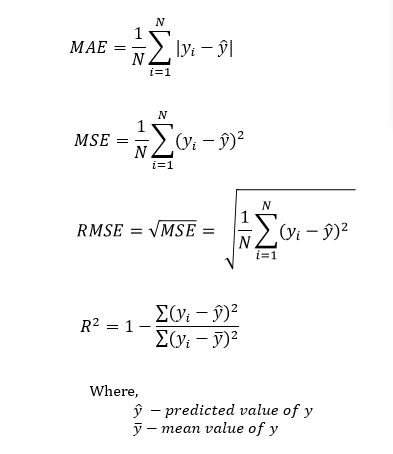

```{r setup, include=FALSE}
knitr::opts_chunk$set(echo = TRUE)

library(tidyverse)
library(sf)
library(spdep)
library(caret)
library(ckanr)
library(FNN)
library(grid)
library(gridExtra)
library(ggcorrplot)
library(jtools)     # for regression model plots
library(broom)
library(tufte)
library(rmarkdown)
library(kableExtra)

# functions
mapTheme <- function(base_size = 12) {
  theme(
    text = element_text( color = "black"),
    plot.title = element_text(size = 14,colour = "black"),
    plot.subtitle=element_text(face="italic"),
    plot.caption=element_text(hjust=0),
    axis.ticks = element_blank(),
    panel.background = element_blank(),axis.title = element_blank(),
    axis.text = element_blank(),
    axis.title.x = element_blank(),
    axis.title.y = element_blank(),
    panel.grid.minor = element_blank(),
    panel.border = element_rect(colour = "black", fill=NA, size=2)
  )
}

plotTheme <- function(base_size = 12) {
  theme(
    text = element_text( color = "black"),
    plot.title = element_text(size = 14,colour = "black"),
    plot.subtitle = element_text(face="italic"),
    plot.caption = element_text(hjust=0),
    axis.ticks = element_blank(),
    panel.background = element_blank(),
    panel.grid.major = element_line("grey80", size = 0.1),
    panel.grid.minor = element_blank(),
    panel.border = element_rect(colour = "black", fill=NA, size=2),
    strip.background = element_rect(fill = "grey80", color = "white"),
    strip.text = element_text(size=12),
    axis.title = element_text(size=12),
    axis.text = element_text(size=10),
    plot.background = element_blank(),
    legend.background = element_blank(),
    legend.title = element_text(colour = "black", face = "italic"),
    legend.text = element_text(colour = "black", face = "italic"),
    strip.text.x = element_text(size = 14)
  )
}

palette5 <- c("#25CB10", "#5AB60C", "#8FA108",   "#C48C04", "#FA7800")

qBr <- function(df, variable, rnd) {
  if (missing(rnd)) {
    as.character(quantile(round(df[[variable]],0),
                          c(.01,.2,.4,.6,.8), na.rm=T))
  } else if (rnd == FALSE | rnd == F) {
    as.character(formatC(quantile(df[[variable]]), digits = 3),
                          c(.01,.2,.4,.6,.8), na.rm=T)
  }
}

q5 <- function(variable) {as.factor(ntile(variable, 5))}

```

## Data Wrangling (from lab \#1)

Start with cleaned and featurized data from previous lab

```{r read_data, results='hide'}
#https://github.com/urbanSpatial/Public-Policy-Analytics-Landing/tree/master/DATA/Chapter3_4

## URL to data
data_src <- "https://raw.githubusercontent.com/urbanSpatial/Public-Policy-Analytics-Landing/master/DATA/Chapter3_4/"

nhoods <-
  st_read("http://bostonopendata-boston.opendata.arcgis.com/datasets/3525b0ee6e6b427f9aab5d0a1d0a1a28_0.geojson") %>%
  st_transform('ESRI:102286')

boston.sf   <- st_read(file.path(data_src,"boston_sf_Ch1_wrangled.geojson"))
```

```{r}
glimpse(boston.sf)
```

## Multivariate Linear Regression

repeating the same multivariate regression as last week. Regressing housing `SalePrice` on a variety of features from the Boston housing data.

```{r Regression}
## Multivariate Regression
reg1 <- lm(SalePrice ~ ., data = st_drop_geometry(boston.sf) %>% 
                                 dplyr::select(SalePrice, LivingArea, 
                                               GROSS_AREA, R_TOTAL_RM, NUM_FLOORS,
                                               R_BDRMS, R_FULL_BTH, R_HALF_BTH, 
                                               R_KITCH, R_FPLACE))
summary(reg1)
```

### Internal model stats

From last week we learned about metrics that the `lm()` function fits internally on the data used in training. Here is a rather complete view of those metrics using the `broom` package.

```{r}
# paste0("Adjust R-Squared: ", round(summary(reg1)$adj.r.squared,2))
broom::glance(reg1)
```

#### Questions:

> ##### What does Adjusted R-squared tell us about this model?
How many variances can be explained by the model.

> ##### What issues may exist with judging the accuracy of a model based solely on the data used to fit the model?

## External model validation

Evaluating a model through its predictions on *new* data.

```{r message=FALSE, warning=FALSE}
# set random seed
set.seed(31357)

# get index for training sample
inTrain <- caret::createDataPartition(
              y = boston.sf$SalePrice, 
              p = .60, list = FALSE)
# split data into training and test
boston.training <- boston.sf[inTrain,] 
boston.test     <- boston.sf[-inTrain,]  

# Regression  
reg2 <- lm(SalePrice ~ ., data = st_drop_geometry(boston.training) %>% 
                                 dplyr::select(SalePrice, LivingArea, 
                                               GROSS_AREA, R_TOTAL_RM, NUM_FLOORS,
                                               R_BDRMS, R_FULL_BTH, R_HALF_BTH, 
                                               R_KITCH, R_FPLACE))

# Run this a number of times to see Adjusted R2
summary(reg2)

## predicting on new data
reg2_predict <- predict(reg2, newdata = boston.test)

```

## Measure generalizability?

> How do we measure a model's ability to predict to new data?

```{r}
## Mean Square Error train and test
rmse.train <- caret::MAE(predict(reg2), boston.training$SalePrice)
rmse.test  <- caret::MAE(reg2_predict, boston.test$SalePrice)
```

> Which error will be greater, the training error or testing error?
---> testing errors should be greater than training errors.But here thing is opposite due to random split.

```{r}
cat("Train MAE: ", as.integer(rmse.train), " \n","Test MAE: ", as.integer(rmse.test))
```

Common regression metrics that compute a single number from the difference between what is predicted and the actual values.



image [from here](https://www.datatechnotes.com/2019/02/regression-model-accuracy-mae-mse-rmse.html)

## Plotting accuracy metrics

```{r}
preds.train <- data.frame(pred   = predict(reg2),
                          actual = boston.training$SalePrice,
                          source = "training data")
preds.test  <- data.frame(pred   = reg2_predict,
                          actual = boston.test$SalePrice,
                          source = "testing data")
preds <- rbind(preds.train, preds.test)

ggplot(preds, aes(x = pred, y = actual, color = source)) +
  geom_point() +
  geom_smooth(method = "lm", color = "green") +
  geom_abline(color = "orange") +
  coord_equal() +
  theme_bw() +
  facet_wrap(~source, ncol = 2) +
  labs(title = "Comparing predictions to actual values",
       x = "Predicted Value",
       y = "Actual Value") +
  theme(
    legend.position = "none"
  )
```

> What insight can we gain from this plot?

> Is there any danger in using a single random split for training/testing data?
Yes, because every data point has different degree of leverage on the predictions and errors.

## Cross-validation

In theory, **Cross**-***validation*** is a technique for assessing how the results of a model generalize to an independent sample. ***Cross***-***validation*** is largely used in settings where the target is prediction and it is necessary to estimate the accuracy of the performance of a predictive model.

In practice, **Cross**-***validation*** is a method to split a data set into a number (referred to as *k*) samples and the use all but one sample (*k* - 1) for training and the remaining sample for testing. This is done *k* times where each sample gets a turn to be the test set. Specifically, this is referred to as **k-folds Cross-Validation**. See the image below from the book as an illustration.


> What is the benefits of using multiple test train splits this way?

> Are there other options for how data can be split?

```{r message=FALSE, warning=FALSE}
# use caret package cross-validation method
fitControl <- caret:: trainControl(method = "cv", 
                           number = 10,
                           # savePredictions differs from book
                           savePredictions = TRUE)

set.seed(717)
# crimes.buffer feature added
# for k-folds CV
reg.cv <- 
  caret::train(SalePrice ~ ., data = st_drop_geometry(boston.sf) %>% 
                                dplyr::select(SalePrice, LivingArea,  
                                               GROSS_AREA, R_TOTAL_RM, NUM_FLOORS,
                                               R_BDRMS, R_FULL_BTH, R_HALF_BTH, 
                                               R_KITCH, R_FPLACE, crimes.Buffer), 
     method = "lm", 
     trControl = fitControl, 
     na.action = na.pass)

reg.cv
```

```{r}
# help to fetch RMSE MAE result. `resample` is a variable inside reg.cv
reg.cv$resample

reg.cv$resample %>% 
  pivot_longer(-Resample) %>% 
  mutate(name = as.factor(name)) %>% 
  ggplot(., aes(x = name, y = value, color = name)) +
  geom_jitter(width = 0.1) +
  facet_wrap(~name, ncol = 3, scales = "free") +
  theme_bw() +
  theme(
    legend.position = "none"
  )
```

> How do we interpret the spread of values between the folds?

```{r}
# extract predictions from CV object
cv_preds <- reg.cv$pred
# compare number of observations between data sets
nrow(boston.sf)
nrow(cv_preds)
```

```{r}
## Create dataset with "out of fold" predictions and original data
map_preds <- boston.sf %>% 
  rowid_to_column(var = "rowIndex") %>% 
  left_join(cv_preds, by = "rowIndex") %>% 
  mutate(SalePrice.AbsError = abs(pred - SalePrice)) %>% 
  cbind(st_coordinates(.))
# weird CRS fix to boston.sf
st_crs(map_preds) <- st_crs(nhoods)

# plot errors on a map
ggplot() +
    geom_sf(data = nhoods, fill = "grey40") +
    geom_sf(data = map_preds, aes(colour = q5(SalePrice.AbsError)),
            show.legend = "point", size = 1) +
    scale_colour_manual(values = palette5,
                     labels=qBr(map_preds,"SalePrice.AbsError"),
                     name="Quintile\nBreaks") +
    labs(title="Absolute sale price errors on the OOF set",
         subtitle = "OOF = 'Out Of Fold'") +
    mapTheme()
```

> Is there a spatial pattern in these errors?

## Spatial Correlation of Errors

Going back to single random data split to align with book

```{r message=FALSE, warning=FALSE}
inTrain <- createDataPartition(
              y = paste(boston.sf$Name, boston.sf$NUM_FLOORS.cat, 
                        boston.sf$Style, boston.sf$R_AC), 
              p = .60, list = FALSE)
boston.training <- boston.sf[inTrain,] 
boston.test <- boston.sf[-inTrain,]  
 
reg.training <- 
  lm(SalePrice ~ ., data = as.data.frame(boston.training) %>% 
                             dplyr::select(SalePrice, LivingArea, Style, 
                                           GROSS_AREA, NUM_FLOORS.cat,
                                           R_BDRMS, R_FULL_BTH, R_HALF_BTH, 
                                           R_KITCH, R_AC, R_FPLACE, crimes.Buffer))

boston.test <-
  boston.test %>%
  mutate(Regression = "Baseline Regression",
         SalePrice.Predict = predict(reg.training, boston.test),
         SalePrice.Error = SalePrice.Predict - SalePrice,
         SalePrice.AbsError = abs(SalePrice.Predict - SalePrice),
         SalePrice.APE = (abs(SalePrice.Predict - SalePrice)) / SalePrice.Predict)%>%
  filter(SalePrice < 5000000) 
```

```{r}
k_nearest_neighbors = 5
#prices
coords <- st_coordinates(boston.sf) 
# k nearest neighbors
neighborList <- knn2nb(knearneigh(coords, k_nearest_neighbors))
spatialWeights <- nb2listw(neighborList, style="W")
boston.sf$lagPrice <- lag.listw(spatialWeights, boston.sf$SalePrice)

# average errors in five nearest neighbors
coords.test <-  st_coordinates(boston.test) 
neighborList.test <- knn2nb(knearneigh(coords.test, k_nearest_neighbors))
spatialWeights.test <- nb2listw(neighborList.test, style="W")
boston.test$lagPriceError <- lag.listw(spatialWeights.test,boston.test$SalePrice.AbsError)

ggplot(boston.sf, aes(x=lagPrice, y=SalePrice)) +
   geom_point(colour = "#FA7800") +
   geom_smooth(method = "lm", se = FALSE, colour = "#25CB10") +
   labs(title = "Price as a function of the spatial lag of price",
        caption = "Public Policy Analytics, Figure 6.6",
        x = "Spatial lag of price (Mean price of 5 nearest neighbors)",
        y = "Sale Price") +
   plotTheme()

ggplot(boston.test, aes(x=lagPriceError, y=SalePrice)) +
    geom_point(colour = "#FA7800") +
    geom_smooth(method = "lm", se = FALSE, colour = "#25CB10") +
    labs(title = "Error as a function of the spatial lag of price",
         caption = "",
         x = "Spatial lag of errors (Mean error of 5 nearest neighbors)",
         y = "Sale Price") +
    plotTheme()
```

> Are sale prices and errors in predicting sales prices correlated across space?

## Moran's I - A measure of spatial correlation

```{r}
moranTest <- moran.mc(boston.test$SalePrice.AbsError, 
                      spatialWeights.test, nsim = 999)

ggplot(as.data.frame(moranTest$res[c(1:999)]), aes(moranTest$res[c(1:999)])) +
  geom_histogram(binwidth = 0.01) +
  geom_vline(aes(xintercept = moranTest$statistic), colour = "#FA7800",size=1) +
  scale_x_continuous(limits = c(-1, 1)) +
  labs(title="Observed and permuted Moran's I",
       subtitle= "Observed Moran's I in orange",
       x="Moran's I",
       y="Count",
       caption="Public Policy Analytics, Figure 6.8") +
  plotTheme()
```

> What does a positive Moran's I tell us?

## Errors by group

```{r message=FALSE, warning=FALSE}
nhood_sum <- boston.test %>% 
    group_by(Name) %>%
    summarize(meanPrice = mean(SalePrice, na.rm = T),
              meanPrediction = mean(SalePrice.Predict, na.rm = T),
              meanMAE = mean(SalePrice.AbsError, na.rm = T))

nhood_sum %>% 
  st_drop_geometry %>%
  arrange(desc(meanMAE)) %>% 
      kable() %>% kable_styling()
```

```{r}
  
## Back to CV predictions for the moment. In the split sample predictions we only get predictions for the nhoods in the test sample; the rest are NA. In the CV split, we get a prediction on each nhood. That makes for a more complete looking map.

  map_preds_sum <- map_preds %>% 
    group_by(Name) %>% 
    summarise(meanMAE = mean(SalePrice.AbsError))
  
  ggplot() +
    geom_sf(data = nhoods %>% 
              left_join(st_drop_geometry(map_preds_sum), by = "Name"),
            aes(fill = q5(meanMAE))) +
      scale_fill_manual(values = palette5,
                     labels=qBr(nhood_sum,"meanMAE"),
                     name="Quintile\nBreaks") +
    mapTheme() +
    labs(title="Absolute sale price errors on the OOF set by Neighborhood")
```

> Do you see a spatial pattern in Neighborhood errors?

## Controlling for Neighborhood

> How might we control for the effect that being in a specific neighborhood has on a sales price?

```{r}
## Neighborhood Fixed Effect
reg.nhood <- lm(SalePrice ~ ., data = as.data.frame(boston.training) %>% 
                                 dplyr::select(Name, SalePrice, LivingArea, 
                                               Style, GROSS_AREA, NUM_FLOORS.cat,
                                               R_BDRMS, R_FULL_BTH, R_HALF_BTH, 
                                               R_KITCH, R_AC, R_FPLACE,crimes.Buffer))

boston.test.nhood <-
  boston.test %>%
  mutate(Regression = "Neighborhood Effects",
         SalePrice.Predict = predict(reg.nhood, boston.test),
         SalePrice.Error = SalePrice - SalePrice.Predict,
         SalePrice.AbsError = abs(SalePrice - SalePrice.Predict),
         SalePrice.APE = (abs(SalePrice - SalePrice.Predict)) / SalePrice) %>%
  filter(SalePrice < 5000000)
```

```{r}
bothRegressions <- 
  rbind(
    dplyr::select(boston.test, starts_with("SalePrice"), Regression, Name) %>%
      mutate(lagPriceError = lag.listw(spatialWeights.test, SalePrice.Error)),
    dplyr::select(boston.test.nhood, starts_with("SalePrice"), Regression, Name) %>%
      mutate(lagPriceError = lag.listw(spatialWeights.test, SalePrice.Error)))    

st_drop_geometry(bothRegressions) %>%
  gather(Variable, Value, -Regression, -Name) %>%
  filter(Variable == "SalePrice.AbsError" | Variable == "SalePrice.APE") %>%
  group_by(Regression, Variable) %>%
    summarize(meanValue = mean(Value, na.rm = T)) %>%
    spread(Variable, meanValue) %>%
    kable() %>%
      kable_styling("striped", full_width = F) %>%
      row_spec(1, color = "black", background = "#25CB10") %>%
      row_spec(2, color = "black", background = "#FA7800")
```

### The key question to be able to answer from this is:

> Which model better captures the spatial process of home sales prices and why?

Here is a good bit of the answer:

```{r}
# model coefficents for each Neighborhood
tidy(reg.nhood) %>% 
  filter(str_detect(term, "Name")) %>% 
  kable() %>% 
  kable_styling()
```
